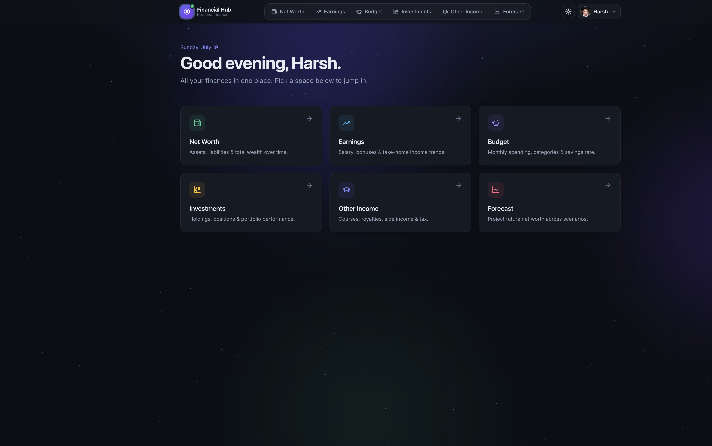
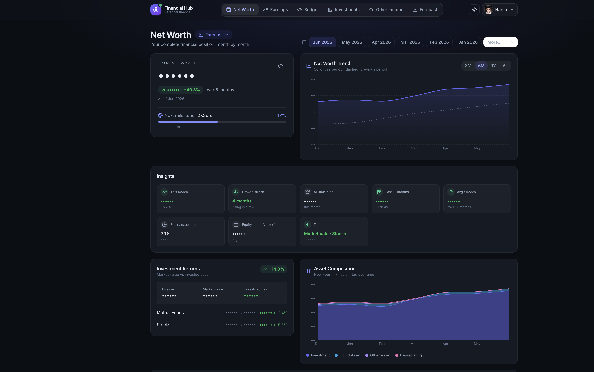
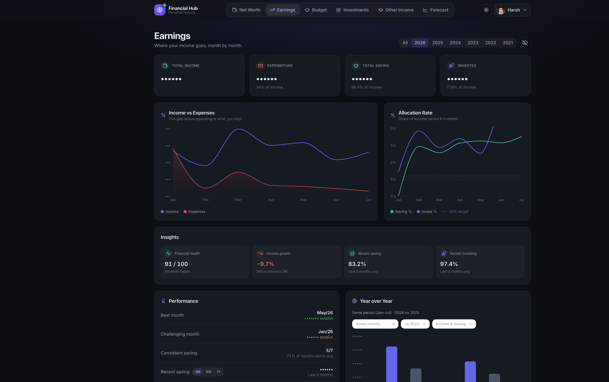
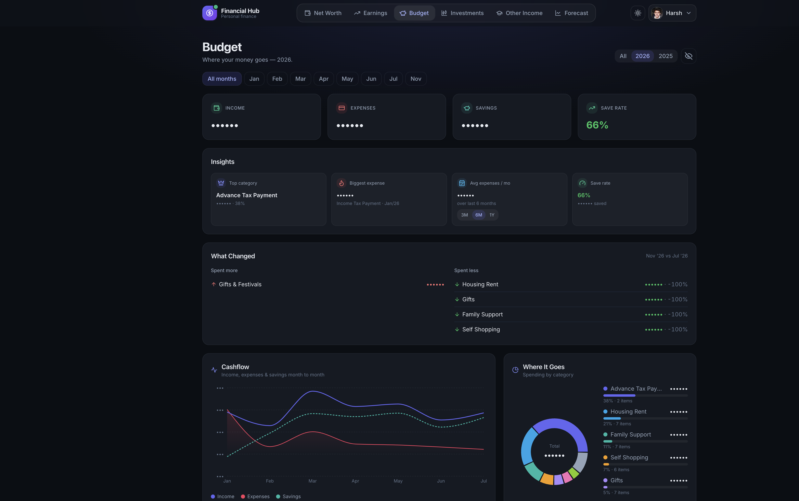
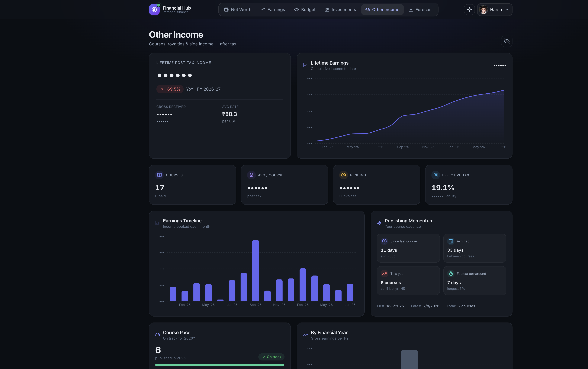
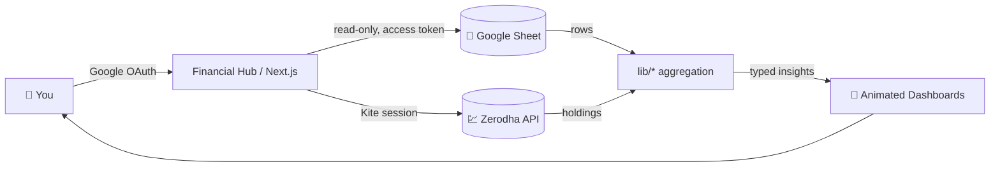

<div align="center">

# 🪐 Financial Hub

### Your entire financial life, in one beautifully animated command center.

A modern personal-finance dashboard that turns a humble Google Sheet into a living, breathing wealth cockpit — net worth, earnings, budgets, investments, side income, and multi-year forecasting, all in one place.

<br />


<br />



</div>

---

## ✨ Overview

**Financial Hub** connects securely to your personal Google Sheet and renders it as a polished, interactive dashboard. There's no database and nothing to migrate — your spreadsheet stays the single source of truth, and the app reads it live over the Google Sheets API.

The experience is built to *feel alive*: an animated cosmic landing hub, scroll-reveal widgets, smooth page transitions between sections, and a theme-aware design system that looks great in both light and dark mode.

> 🔒 **Read-only & private.** The app only ever *reads* your sheet. No financial data is stored on any server — every number you see is fetched directly from your own Google Sheet in real time.

---

## 🚀 Features

| | Section | What it shows |
|---|---|---|
| 🏠 | **Home Hub** | Animated cosmic landing page with a personalized greeting and launcher cards into every dashboard. |
| 📊 | **Net Worth** | Total wealth over time, milestone tracking, investment returns, and asset composition trends. |
| 📈 | **Earnings** | Income vs. expenses, allocation/savings rate, financial-health score, and year-over-year comparisons. |
| 🐷 | **Budget** | Monthly spending by category, "what changed" deltas, cashflow, and a category spend donut. |
| 💹 | **Investments** | Live holdings and portfolio performance via a Zerodha (Kite) connection. |
| 🎓 | **Other Income** | Course/royalty/side-income analytics — lifetime post-tax income, publishing momentum, course pace, and a full advance-tax tracker. |
| 🔮 | **Forecast** | Multi-scenario (Conservative / Base / Aggressive) net-worth projections, FI (financial independence) modeling, and life-event planning. |

**Across the whole app:**

- 🎨 Cohesive, theme-aware design system (light + dark) with a unified indigo palette
- 🌌 Live cosmic canvas background (starfield, nebula glow, shooting stars) — respects `prefers-reduced-motion`
- 🪄 Framer Motion scroll-reveal widgets and animated page transitions
- 👁️ Global **privacy mode** to instantly mask every monetary value
- 🔐 Secure Google OAuth sign-in with automatic token refresh
- 📱 Fully responsive, from mobile to ultrawide

---

## 📸 Screenshots

<div align="center">

### 🏠 Home Hub
*Animated cosmic landing page — pick a space to dive into.*


### 📊 Net Worth
*Total wealth, milestones, investment returns, and asset composition.*



### 📈 Earnings
*Income vs. expenses, allocation rate, and financial-health insights.*



### 🐷 Budget
*Category spending, what-changed deltas, cashflow, and where it goes.*



### 🎓 Other Income
*Post-tax income, publishing momentum, course pace, and tax tracking.*



</div>

> 🙈 All screenshots are captured with **privacy mode** enabled, so every monetary amount is masked (`••••••`). Flip the toggle in the app to reveal your real numbers.

---

## 🧭 How It Works



1. **Sign in** with Google — the app requests read-only access to your Sheets.
2. **Land on the Home Hub** and pick a section.
3. Each API route fetches the relevant tab(s) from your sheet, and the `lib/` layer aggregates raw rows into typed insights (trends, rates, forecasts, tax breakdowns).
4. Widgets animate into view as you scroll; switching sections plays a smooth transition.
5. Expired Google tokens are refreshed automatically; upstream auth failures surface as a fast re-auth prompt instead of a hanging spinner.

---

## 🛠️ Tech Stack

| Layer | Technology |
|---|---|
| **Framework** | Next.js 14 (App Router), React 18, TypeScript |
| **Styling** | Tailwind CSS with custom design tokens (`nw-card`, `nw-text-*`, `nw-control`) |
| **Animation** | Framer Motion (scroll reveals, page transitions) + a hand-built canvas cosmic background |
| **Charts** | Recharts (theme- & privacy-aware) |
| **Auth** | NextAuth.js with the Google provider |
| **Data** | Google Sheets API v4 (`googleapis`) + Zerodha Kite API for investments |
| **Icons** | lucide-react |
| **Testing** | Vitest |
| **Hosting** | Vercel |

---

## 📂 Project Structure

```
net-worth-tracker/
├── app/
│   ├── api/                 # Server routes (all read-only)
│   │   ├── auth/            # NextAuth (Google) configuration
│   │   ├── budget/          # Budget aggregation endpoint
│   │   ├── comparison/      # Year-over-year comparison data
│   │   ├── earnings/        # Earnings endpoint
│   │   ├── months/          # Available months / sheet tabs
│   │   ├── other-income/    # Course & side-income endpoint
│   │   ├── sheets/          # Google Sheets helpers
│   │   └── zerodha/         # Kite login / callback / holdings
│   ├── layout.tsx           # Root layout
│   ├── page.tsx             # App shell: nav + page transitions + Home Hub
│   └── providers.tsx        # Session / theme / privacy providers
│
├── components/
│   ├── HomeHub.tsx          # Animated landing hub
│   ├── DashboardSelector.tsx# Top navigation shell (sliding pill, theme toggle)
│   ├── LoginCard.tsx        # Animated sign-in screen
│   ├── networth/            # Net Worth widgets & charts
│   ├── earnings/            # Earnings widgets & charts
│   ├── budget/              # Budget widgets & charts
│   ├── otherincome/         # Other Income widgets & charts
│   ├── forecast/            # Forecast engine UI (KPIs, scenarios, FI, events)
│   └── motion/              # Reveal.tsx + CosmicBackground.tsx
│
├── lib/                     # Aggregation & domain logic
│   ├── auth.ts              # Token refresh logic
│   ├── netWorth.ts | earnings.ts | budget.ts | otherIncome.ts
│   ├── zerodha.ts           # Kite integration
│   ├── format.ts            # Currency / number formatting
│   └── forecast/            # Projection engine (+ engine.test.ts)
│
├── contexts/ · hooks/ · types/
├── docs/screenshots/        # Images used in this README
├── tailwind.config.js · next.config.js · vercel.json
└── vitest.config.ts
```

---

## ⚡ Getting Started

### Prerequisites

- Node.js 18+
- A Google account with a finance spreadsheet
- (Optional) A Zerodha Kite Connect app for the Investments tab

### 1. Install

```bash
cd net-worth-tracker
npm install
```

### 2. Google Cloud setup

1. Open the [Google Cloud Console](https://console.cloud.google.com/) and create/select a project.
2. Enable the **Google Sheets API** (and **Google Drive API**).
3. Create **OAuth 2.0** credentials (Web application) with these redirect URIs:
   - `http://localhost:3000/api/auth/callback/google`
   - `https://your-domain.vercel.app/api/auth/callback/google` (production)

### 3. Prepare your sheet

1. Use a Google Sheet with one tab per month, following your existing layout.
2. Share it with the Google account you'll sign in with.
3. Grab the Sheet ID from the URL: `https://docs.google.com/spreadsheets/d/{SHEET_ID}/edit`.

### 4. Environment variables

Create `.env.local` (see `.env.example`):

```env
# NextAuth
NEXTAUTH_URL=http://localhost:3000
NEXTAUTH_SECRET=generate-a-random-secret-string

# Google OAuth
GOOGLE_CLIENT_ID=your-google-client-id
GOOGLE_CLIENT_SECRET=your-google-client-secret

# Google Sheets
GOOGLE_SHEET_ID=your-google-sheet-id

# Zerodha / Kite (optional — only for the Investments tab)
KITE_API_KEY=your-kite-api-key
KITE_API_SECRET=your-kite-api-secret
```

> 💡 Generate a strong secret with `openssl rand -base64 32`.

### 5. Run

```bash
npm run dev
```

Visit **http://localhost:3000** and sign in with Google.

---

## 📜 Scripts

| Command | Description |
|---|---|
| `npm run dev` | Start the dev server |
| `npm run build` | Production build |
| `npm run start` | Run the production build |
| `npm run lint` | Lint with Next's ESLint config |
| `npm run type-check` | Type-check with `tsc --noEmit` |
| `npm run test` | Run the Vitest suite |
| `npm run test:watch` | Run tests in watch mode |

---

## ☁️ Deployment (Vercel)

1. Push the repo to GitHub and import it into [Vercel](https://vercel.com/).
2. Add every variable from `.env.local` in **Project → Settings → Environment Variables**.
3. Add your Vercel domain to the Google OAuth redirect URIs:
   `https://your-app.vercel.app/api/auth/callback/google`
4. Deploy — Vercel auto-builds on every push to the default branch.

```bash
# or from the CLI
npm i -g vercel
vercel --prod
```

---

## 🔐 Security & Privacy

- **Read-only** access to your Google Sheets — the app never writes to your data.
- **No server-side storage** of financial data; everything is fetched live per request.
- **Privacy mode** masks every amount on screen with a single toggle.
- Auth is handled entirely through Google OAuth, with refresh tokens rotated automatically.

---

## 🧰 Troubleshooting

| Symptom | Fix |
|---|---|
| `Unauthorized` / blank screen after sign-in | Re-sign in — the token likely expired. Verify OAuth credentials and redirect URIs. |
| `Sheet not found` | Check `GOOGLE_SHEET_ID` and that the sheet is shared with your account. |
| Data not loading | Confirm the sheet's tab/column layout matches what the `lib/` parsers expect. |
| Investments tab empty | Ensure `KITE_API_KEY` / `KITE_API_SECRET` are set and you've completed the Kite login flow. |

---

## 💸 Cost

| Component | Cost |
|---|---|
| Hosting (Vercel) | Free tier |
| Database (Google Sheets) | Free |
| Authentication (Google OAuth) | Free |
| **Total** | **₹0 / month** |

---

## 📄 License

MIT — free to use, fork, and customize for your own finances.

<div align="center">
<br />
Built with Next.js, Tailwind, and a lot of Framer Motion. ✨
</div>
